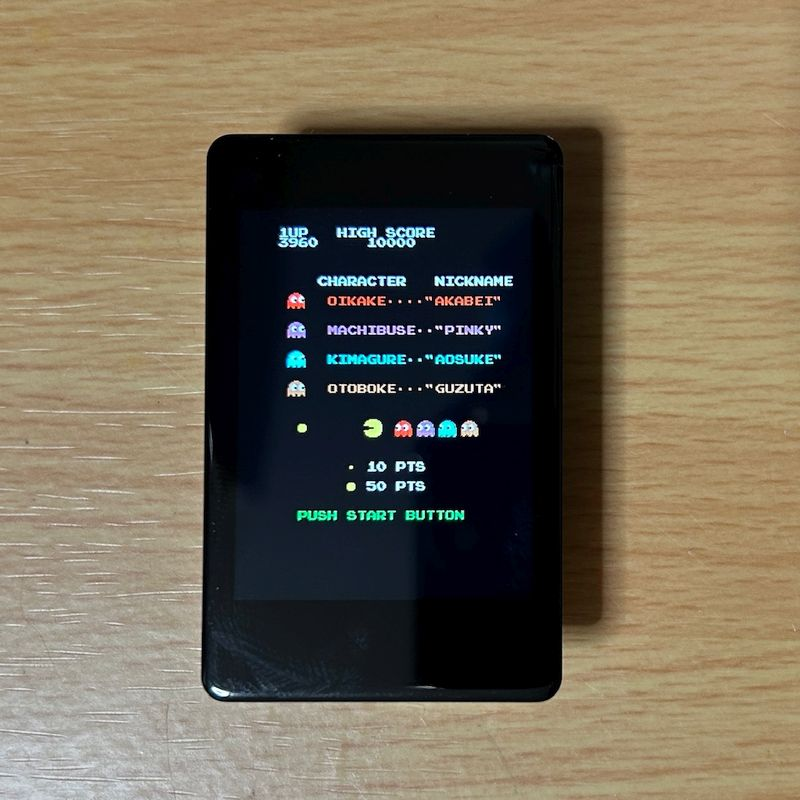
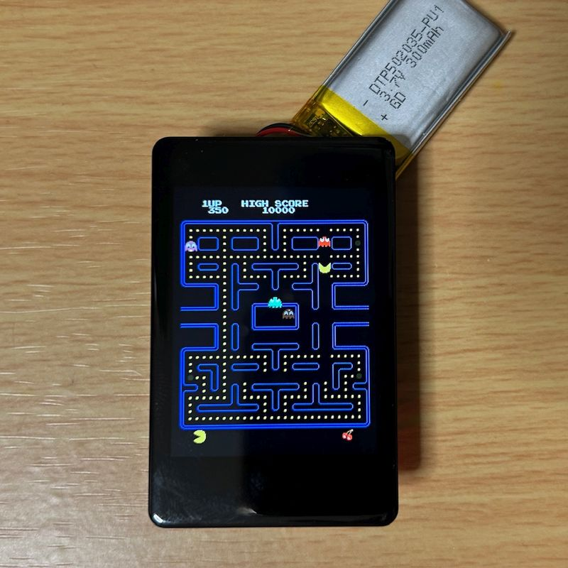
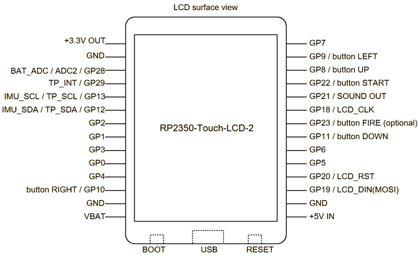

# PACMAN for RP2350-Touch-LCD-2

  
Waveshare製RP2350-Touch-LCD-2で遊べるパックマンです。アーケード版に更新しました。

## 実行方法
RP2350-Touch-LCD-2のBOOTボタンを押しながらUSBケーブルでPCに接続し、uf2ディレクトリのpacman-rp2350-touch-lcd-2.uf2をRP2350-Touch-LCD-2にコピーしてください。  
  
## 遊び方
操作方法は3種類あります。  
* 内蔵加速度センサ  
RP2350-Touch-LCD-2に搭載の加速度センサを利用し、画面を傾けてパックマンの移動方向を変更します。ゲーム開始するには、画面の端を軽く叩いてください。衝撃を検知して開始します。
* USBキーボード  
USB OTGケーブル（アダプタ）でUSBキーボードを接続するとキーボードでプレイができます。Enterキーでゲーム開始、カーソルキーでパックマンの移動方向を変更します。
* ボタン  
5個のタクトスイッチを以下のように接続することでボタンでプレイができます。各スイッチの反対側はGND端子に接続します。  
GP8 　UP  
GP11　DOWN  
GP9 　LEFT  
GP10　RIGHT  
GP22　START  

  

## 電源
Li-Poバッテリ、USB、+5V IN端子の3種類のいずれかから電源供給してください。USBキーボードを使用する場合、Li-Poバッテリでは動作しません。

## サウンド
GP21に圧電スピーカー等を接続することでサウンドを鳴らすことができます。

## 参考リンク
[Waveshare RP2350-Touch-LCD-2 Wiki](https://www.waveshare.com/wiki/RP2350-Touch-LCD-2)  
